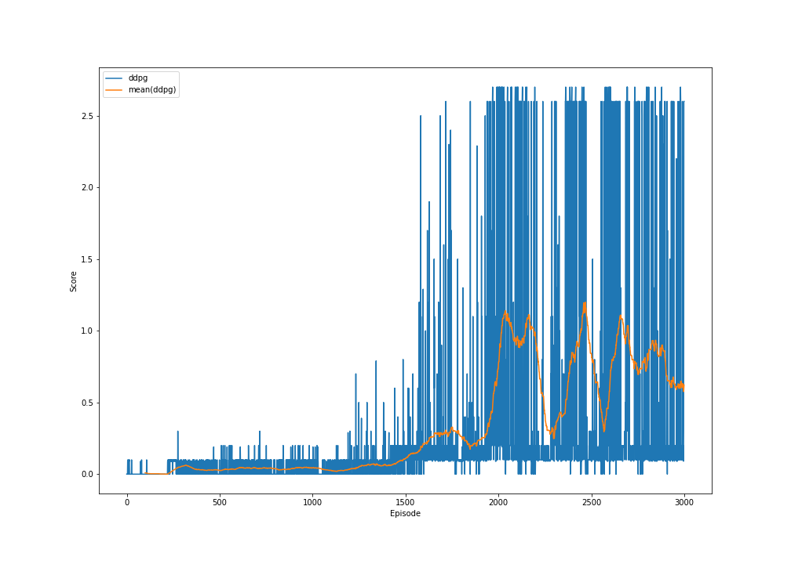

# Report
by Luca Schweri, 2022

## Learning Algorithms

### DDPG

#### Architecture

**Actor Network**:

The following list describes the layers of the network:
1) Linear(24 -> 64) -> ReLU
2) Linear(64 -> 16) -> ReLU
3) Linear(16 -> 2)

The network output is then clipped to a value between [-1; 1] to fit the action space.
The implementation of the architecture can be found in [ddpg_actor_network.py](networks/ddpg_actor_network.py).

**Critic Network**:

1) Linear(26 -> 64) -> ReLU
2) Linear(64 -> 16) -> ReLU
3) Linear(16 -> 1)

The implementation of the architecture can be found in [ddpg_critic_network.py](networks/dq_network.py).

#### Hyperparameters

- Number of Episodes for Training: 3000
- Actor Learning Rate: 0.0001
- Critic Learning Rate: 0.001
- Experience replay buffer size: 100000
- Batch size: 128
- Learning every ? steps: 1
- Learning repetitions: 1
- Discount Factor: 0.99
- Exponential Moving Average Factor for Target Network Updates: 0.001
- N-step bootstrapping parameter: 5

It uses Deep Deterministic Policy Gradients (DDPG) [Lillicrap et al.](https://arxiv.org/abs/1509.02971)

The configurations for this approach can be found in [config.json](data/ddpg/config.json) with the name "ddpg".

#### Results

The plots and saved network parameters can be found in [dqn_prioritized](data/ddpg).

## Ideas

The following is list of possible further improvements of the agent:
- **Small Action Regularization Loss**: Add a loss with small weight for larger movements. This would ensure that the players do not make unnecessary movements.
- **Avoid Large Decrease in Score**: If after an update the agent performs much worse than before reset the parameters to the old value before the update. 
- **Random State Perturbations**: For the models using experience replay buffer the state could be perturbed by a little to gain robustness.
- **Adversarial Training**: A better way to gain robustness would be to use adversarial training.
- **State Normalization**: If we would have some more information about the state, one could normalize the state before using it as input for the network. This might help.
- **Next State Prediction**: Additional to the action values the network should predict the next state of each action. This might help in finding better network parameters because the next state is correlated with the action values.
- **Different Network**: I have used very easy networks. Many more network architectures can be tested.
- **Further Hyperparameter Tuning**: I did some hyperparameter tuning but there is still some room for improvements.